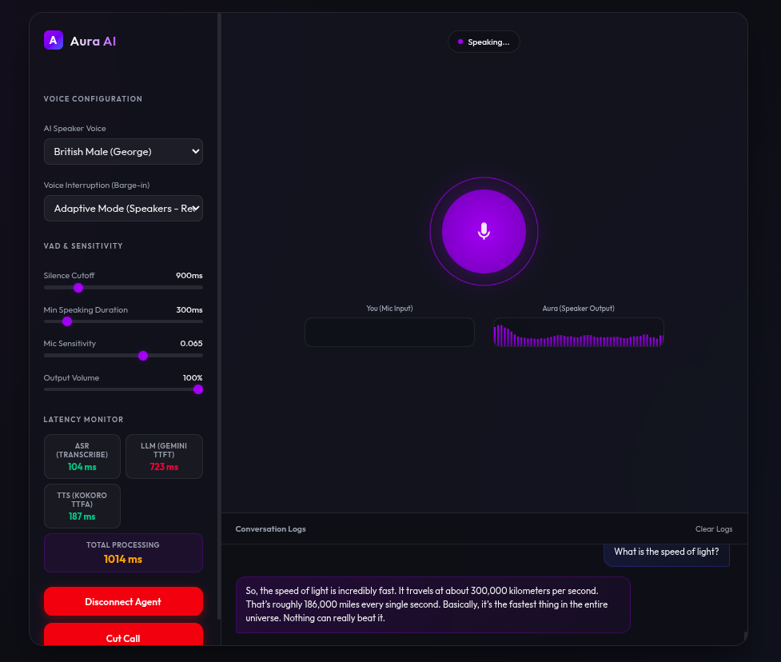
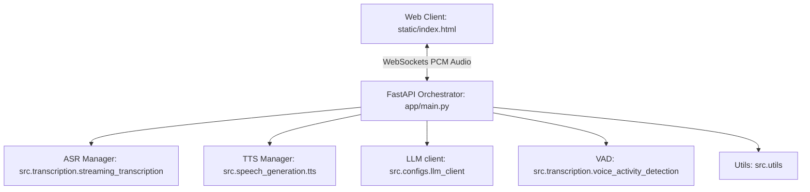

# AuraAI - Real-time Voice-to-Voice AI Companion

AuraAI is a real-time conversational Audio-to-Audio companion. Built with a fast, modern, and highly modular backend using FastAPI, it handles continuous WebSocket audio streams from a browser client, performs streaming Automatic Speech Recognition (ASR), generates conversational text responses using Gemini 3.5, and synthesizes natural-sounding speech responses using Kokoro TTS.

---

## 🖥️ User Interface



---

## 🏗️ Architecture & Component Design

The project is structured into clean, decoupled domain packages:



*   **ASR (`src.transcription`):** Powered by `sherpa-onnx` and Kroko Streaming ASR models. Running on **CPU** for ultra-stable, crash-free, and high-speed local transcription.
*   **VAD (`src.transcription`):** Utilizes `webrtcvad` and raw audio energy calculation to accurately detect voice activity boundaries, managing turn-taking and user interruptions (barge-in).
*   **TTS (`src.speech_generation`):** Uses Kokoro 82M model via the **`kokoro-onnx`** package, running fully accelerated on **GPU (CUDA)** using a custom `InferenceSession` with `CUDAExecutionProvider` to drop synthesis latency to **~150ms**.
*   **LLM (`src.configs.llm_client`):** Wraps Google's Generative AI client (Gemini 3.1 Flash Lite) with instructions optimized for spoken dialogue.

---

## 🛠️ Prerequisites & Setup

### 1. Requirements
*   Python 3.10+
*   NVIDIA GPU & CUDA Toolkit (Recommended for accelerated Kokoro TTS)
*   Web Browser with Microphone access (must run under localhost or HTTPS for Web Audio API permissions)

### 2. Installation & GPU Configuration

1.  **Clone the repository:**
    ```bash
    git clone https://github.com/your-username/Audio2Audio.git
    cd Audio2Audio
    ```

2.  **Set up the Virtual Environment:**
    ```bash
    python3 -m venv .venv
    source .venv/bin/activate
    ```

3.  **Install dependencies:**
    ```bash
    pip install -r requirements.txt
    ```

4.  **Resolve ONNX GPU Conflicts (Crucial for GPU TTS execution):**
    Ensure only the GPU version of ONNX Runtime is installed to prevent fallback to CPU:
    ```bash
    .venv/bin/pip uninstall -y onnxruntime onnxruntime-gpu
    .venv/bin/pip install onnxruntime-gpu==1.20.0
    ```

5.  **Configure environment variables:**
    Copy `.env.example` to `.env` and insert your Gemini API Key:
    ```bash
    cp .env.example .env
    # Edit .env and set GEMINI_API_KEY
    ```

---

## 🚀 Running the Application

To ensure that the virtualenv python preloads CUDA libraries successfully, launch the application using:

```bash
PYTHONPATH=app .venv/bin/python -m uvicorn main:app
```

Once running, navigate to:
👉 [http://localhost:8000/](http://localhost:8000/)

Ensure you give the page permission to access your microphone. Click **Start Listening** and start speaking!

---

## 🌟 Key Features

*   **GPU & CPU Hybrid Execution:** Kokoro TTS runs fully on GPU (CUDA) for lightning-fast speech synthesis, while Kroko ASR runs on CPU to prevent dynamic library / C++ thread context conflicts during code reloads.
*   **Continuous Context Memory:** Keeps track of the **last 10 messages** (approx. 5 complete conversation turns) via a sliding-window message queue, allowing Gemini to maintain context and hold a natural conversation.
*   **Automatic Model Downloader:** Automatically verifies and downloads ASR models (`Kroko-Streaming-ASR-Python`) and TTS models (`Kroko-82M`) from Hugging Face and GitHub Releases on application startup, featuring a clean terminal progress bar.
*   **Barge-in / Interruption Support:** If the AI is speaking and you interrupt it, the playback halts immediately and starts listening to your next command.
*   **VAD Turn Taking:** Uses voice activity detection and energy levels to know when you start and finish speaking automatically.
*   **Real-time Transcription:** The screen displays interim transcripts as you speak.
*   **Latency Metrics:** Shows real-time backend latency metrics (ASR latency, LLM latency, TTS latency, and overall roundtrip time).
*   **Parameter Tuning:** Features live adjustment sliders for Silence Cutoff, Min Speaking Duration, and Mic Sensitivity to fine-tune the voice activation boundaries.

---

## ⚡ Latency & Performance Profile

Below is the average latency profile of the different components in AuraAI's voice-to-voice conversational loop:

| Component | Process Stage | Average Latency | Execution Context | Notes |
| :--- | :--- | :--- | :--- | :--- |
| **ASR (Transcription)** | Real-time audio stream decoding | `80ms - 120ms` | CPU | Kroko Streaming ASR (ultra-lightweight local model) |
| **LLM (Gemini)** | Time to First Token (TTFT) | `700ms - 1500ms` | Cloud (Google GenAI) | Depends on the selected model and context size |
| **TTS (Speech Synthesis)** | Time to First Audio Chunk (TTFA) | `200ms - 400ms` | GPU (CUDA) | Kokoro ONNX (GPU-accelerated local execution) |
| **Total Response Loop** | End-of-speech to start of playback | `~1.0s - 2.0s` | Hybrid | Provides highly natural, near-instant dialogue turn-taking |

---

## 🔮 Future Improvements & Roadmap

The following features are planned for future versions of AuraAI:

1.  **Acoustic Scene Classification & Audio Input Labeling:**
    *   **Speaker Classification:** Implement real-time classification to dynamically label incoming stream frames (e.g., distinguishing `Primary User Speaking` from `Secondary/Background Speakers` in group settings).
    *   **Echo Cancellation (AEC):** Filter out speaker playback feedback (`AI Speaking` echo) from the microphone input channel without requiring headphones.
    *   **Noise vs. Speech Identification:** Differentiate between ambient background sounds (sighs, mouse clicks, keyboard clicks, breathing) and valid human speech inputs.
2.  **GPU-Accelerated ASR Execution:**
    *   Move ASR to GPU execution mode by resolving the C++ standard library `std::length_error` process allocation conflicts during Uvicorn reloading loops.
3.  **Semantic Interruption Handling:**
    *   Implement an intelligent barge-in algorithm that uses low-latency semantic analysis to decide whether the user is actively correcting the AI (which should trigger an interruption) or just voicing a simple acknowledgement like *"Hmm"* or *"Oh"* (which should not cut off the AI's flow).